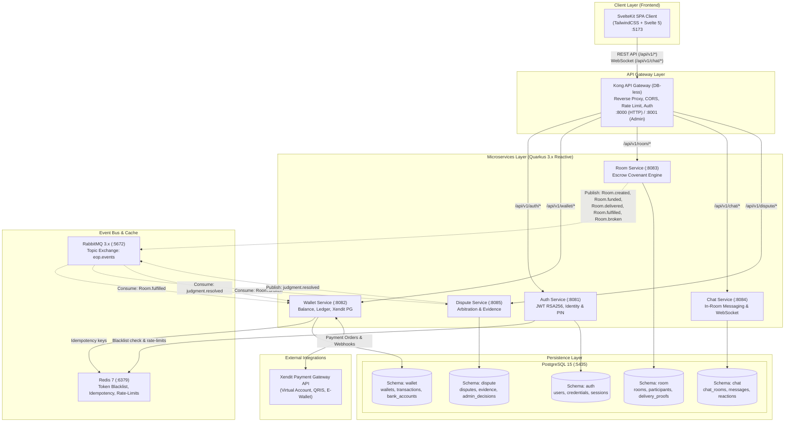
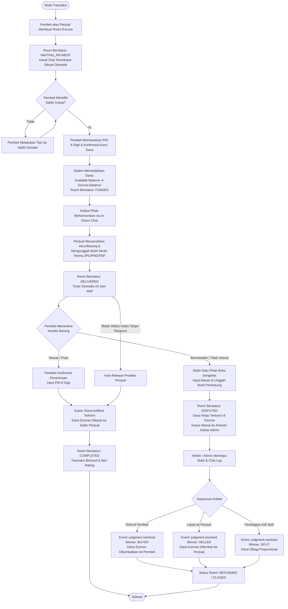

# EyesOfPriestess — System Flowchart & Architecture Diagrams

Dokumen ini berisi diagram alur (*flowcharts*) dan arsitektur sistem berbasis sintaks **Mermaid** untuk proyek Capstone S1 **EyesOfPriestess — The Covenant Protocol**.

---

## 1. Arsitektur Topologi Sistem & Komunikasi Layanan

Diagram arsitektur microservices terdistribusi terhubung melalui Kong API Gateway, asynchronous message broker (RabbitMQ), cache & rate-limiter (Redis), database multi-schema (PostgreSQL), dan integrasi payment gateway (Xendit).



---

## 2. Alur Transaksi Escrow Covenant (Escrow Room Lifecycle)

Flowchart siklus hidup transaksi escrow mulai dari pembuatan kesepakatan, penguncian dana, serah terima, hingga penyelesaian transaksi atau sengketa mediasi.



---

## 3. Alur Autentikasi, Keamanan JWT, & RBAC Guard

Flowchart proses registrasi, login, penerbitan token JWT asimetris RSA256, rotasi refresh token, dan pengecekan otorisasi Role-Based Access Control.

```mermaid
flowchart TD
    USER_REQ([Pengguna Mengakses Sistem]) --> IS_AUTH{Memiliki Token JWT Valid?}

    IS_AUTH -- Tidak --> LOGIN_REGISTER{Aksi Pengguna}
    
    LOGIN_REGISTER -- Register --> REG_FORM[Pengguna Isi Form:<br/>Email, No HP, Nama, Password, PIN 6 Digit]
    REG_FORM --> REG_VALIDATE{Validasi Input & Format}
    REG_VALIDATE -- Gagal --> REG_ERROR[Inline Feedback Error 400/422] --> REG_FORM
    REG_VALIDATE -- Berhasil --> HASH_PASS[Bcrypt Hash Password & PIN]
    HASH_PASS --> INSERT_USER[Simpan ke auth.users & wallet.wallets Otomatis]
    INSERT_USER --> REG_SUCCESS[Registrasi Sukses (HTTP 201) ➔ Arahkan ke Login]

    LOGIN_REGISTER -- Login --> LOGIN_FORM[Pengguna Input Email/No HP & Password]
    LOGIN_FORM --> VERIFY_PASS{Cek Hash Password di auth.credentials}
    VERIFY_PASS -- Salah --> INC_ATTEMPTS[Tambah Hitungan Gagal<br/>Jika >= 5 Kunci Akun Sementara] --> LOGIN_ERROR[HTTP 401: Kredensial Tidak Sah]
    VERIFY_PASS -- Benar --> GEN_JWT[Penerbitan Sepasang Token:<br/>1. Access Token RSA256 (Exp: 15 Menit)<br/>2. Refresh Token JTI (Exp: 7 Hari)]
    GEN_JWT --> SAVE_STORAGE[Simpan Token di LocalStorage Client]
    SAVE_STORAGE --> REDIRECT_DASH[Redirect Otomatis ke /dashboard]

    IS_AUTH -- Ya --> REQ_RESOURCE[Request Mengakses Endpoint Private]
    REQ_RESOURCE --> CHECK_BLACKLIST{Cek Token JTI di Redis Blacklist?}
    CHECK_BLACKLIST -- Masuk Blacklist/Insta-Ban --> FORBIDDEN_401[HTTP 401: Sesi Dibatalkan ➔ Logout]
    CHECK_BLACKLIST -- Aman --> CHECK_EXPIRY{Token Kedaluwarsa?}

    CHECK_EXPIRY -- Ya --> AUTO_REFRESH[Kirim Refresh Token ke /api/v1/auth/renew]
    AUTO_REFRESH --> REFRESH_OK{Refresh Token Sah?}
    REFRESH_OK -- Ya --> ISSUE_NEW[Terbitkan Access Token Baru] --> REQ_RESOURCE
    REFRESH_OK -- Tidak --> PURGE_SESSION[Purge Storage & Redirect ke /login]

    CHECK_EXPIRY -- Tidak --> RBAC_CHECK{Memeriksa Peran Pengguna}
    RBAC_CHECK -- Role: USER --> ALLOW_USER[Akses Halaman Pengguna: Dashboard, Dompet, Room, Chat]
    RBAC_CHECK -- Role: ADMIN --> ALLOW_ADMIN[Akses Penuh: Dashboard Admin, Mediasi Sengketa, Ban Akun]
    ALLOW_USER -- Mencoba Akses /admin/* --> DENY_403[HTTP 403 Forbidden: Akses Khusus Arbiter]
```

---

## 4. Alur Top-Up & Pembayaran Gateway (Xendit Lifecycle)

Flowchart integrasi pembayaran otomatis dari request order, pembuatan invoice Virtual Account / QRIS, proses pembayaran oleh nasabah, hingga konfirmasi webhook asinkron.

```mermaid
flowchart TD
    START_TOPUP([Pengguna Ingin Tambah Saldo]) --> OPEN_TOPUP[Buka Halaman /topup]
    OPEN_TOPUP --> INPUT_AMOUNT[Pilih Metode: Virtual Account / QRIS / E-Wallet<br/>Masukkan Nominal Top-Up]
    INPUT_AMOUNT --> POST_ORDER[POST /api/v1/wallet/topup]
    
    POST_ORDER --> CALL_XENDIT[Wallet Service Menghubungi API Xendit Sandbox]
    CALL_XENDIT --> XENDIT_RESP[Xendit Mengembalikan:<br/>Nomor VA / QR String / Invoice URL]
    XENDIT_RESP --> SAVE_PENDING[Simpan ke wallet.topup_orders (Status: PENDING)]
    SAVE_PENDING --> SHOW_PAYMENT[Tampilkan Detail Pembayaran & Countdown Kedaluwarsa di UI]

    SHOW_PAYMENT --> USER_PAY[Pengguna Melakukan Transfer Bank / Scan QRIS]
    USER_PAY --> XENDIT_DETECT[Sistem Bank / Xendit Mendeteksi Dana Masuk]
    
    XENDIT_DETECT --> WEBHOOK_POST[Xendit Mengirim Webhook Callback:<br/>POST /api/v1/wallet/webhook]
    WEBHOOK_POST --> VERIFY_TOKEN{Validasi X-Callback-Token}
    
    VERIFY_TOKEN -- Palsu / Tidak Sah --> REJECT_403[HTTP 403: Forbidden Callback]
    VERIFY_TOKEN -- Sah --> CHECK_IDEMPOTENCY{Cek Idempotency Key di Redis}

    CHECK_IDEMPOTENCY -- Sudah Diproses Sebelumnya --> ACK_SUCCESS[Acknowledge HTTP 200 (No-Op)]
    CHECK_IDEMPOTENCY -- Request Baru --> TX_BEGIN[Buka Database Transaction PostgreSQL]

    TX_BEGIN --> UPDATE_ORDER[Update Status Order: SUCCESS / PAID]
    UPDATE_ORDER --> CREDIT_WALLET[Tambah Saldo: wallet.wallets.available_balance]
    CREDIT_WALLET --> INSERT_LEDGER[Catat Transaksi: wallet.transactions (Type: TOPUP, Direction: IN)]
    INSERT_LEDGER --> COMMIT_TX[Commit Transaksi & Simpan Key di Redis]
    COMMIT_TX --> NOTIFY_USER[WebSocket / Realtime Update Saldo ke Frontend Pengguna]
    NOTIFY_USER --> SUCCESS_END([Saldo Masuk & Siap Digunakan])
```

---

## 5. Alur Mediasi Sengketa (Dispute & Arbitration Flow)

Flowchart penyelesaian perselisihan transaksi di bawah kendali *High Oracle Administrator* / *Arbiter Sanctum*.

```mermaid
flowchart TD
    DISPUTE_TRIGGER([Pembeli / Penjual Menemukan Masalah]) --> FORM_DISPUTE[Buka Modal 'Laporkan Sengketa' di Room Escrow]
    FORM_DISPUTE --> FILL_REASON[Pilih Kategori Kendala & Tulis Kronologi]
    FILL_REASON --> ATTACH_FILES[Unggah File Bukti screenshot/PDF via FileUpload]
    ATTACH_FILES --> SUBMIT_DISPUTE[POST /api/v1/room/{id}/dispute]

    SUBMIT_DISPUTE --> EVENT_BROKEN[Publish Event: Room.broken]
    EVENT_BROKEN --> DISPUTE_SERVICE[Dispute Service Menangkap Event]
    DISPUTE_SERVICE --> OPEN_CASE[Buka Kasus di dispute.disputes (Status: OPEN)]
    OPEN_CASE --> ROOM_STATUS_UPDATE[Room Berubah ke Status: DISPUTED<br/>Dana Escrow Dibekukan Total]

    ROOM_STATUS_UPDATE --> ADMIN_NOTIF[Notifikasi Masuk ke Antrean /admin#disputes]
    ADMIN_NOTIF --> ADMIN_REVIEW[Arbiter Admin Membuka Detail Kasus & Bukti]

    ADMIN_REVIEW --> INVESTIGATE[Arbiter Meneliti:<br/>1. Bukti Gambar & Dokumen Serah Terima<br/>2. Jejak Riwayat Pesan di In-Room Chat<br/>3. Kredensial & Batas Waktu]
    
    INVESTIGATE --> HEAR_PARTIES{Perlu Bukti Tambahan?}
    HEAR_PARTIES -- Ya --> REQUEST_MORE[Admin Mengirim Pesan Peringatan Resmi di Chat] --> INVESTIGATE
    HEAR_PARTIES -- Cukup --> JUDGMENT_ACTION[Arbiter Memilih Tindakan Resolusi]

    JUDGMENT_ACTION -- Refund Pembeli --> RESOLVE_BUYER[POST /api/v1/dispute/{id}/resolve<br/>Decision: REFUND_BUYER]
    JUDGMENT_ACTION -- Release Penjual --> RESOLVE_SELLER[POST /api/v1/dispute/{id}/resolve<br/>Decision: RELEASE_TO_SELLER]

    RESOLVE_BUYER --> RABBIT_RESOLVED[Publish Event: judgment.resolved]
    RESOLVE_SELLER --> RABBIT_RESOLVED

    RABBIT_RESOLVED --> WALLET_EXECUTE[Wallet Service Mengeksekusi Ledger]:
    WALLET_EXECUTE --> UNLOCK_FINANCE[Pencairan Dana Otomatis ke Dompet Pemenang Sengketa]
    UNLOCK_FINANCE --> CASE_CLOSED[Status Sengketa: RESOLVED & Status Room: COMPLETED/REFUNDED]
    CASE_CLOSED --> TOAST_NOTIF[Toast Notifikasi Hasil Keputusan Muncul di Akun Kedua Pengguna]
    TOAST_NOTIF --> END_DISPUTE([Kasus Selesai])
```
