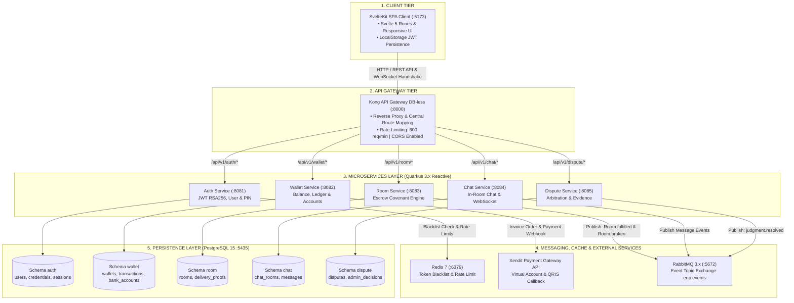
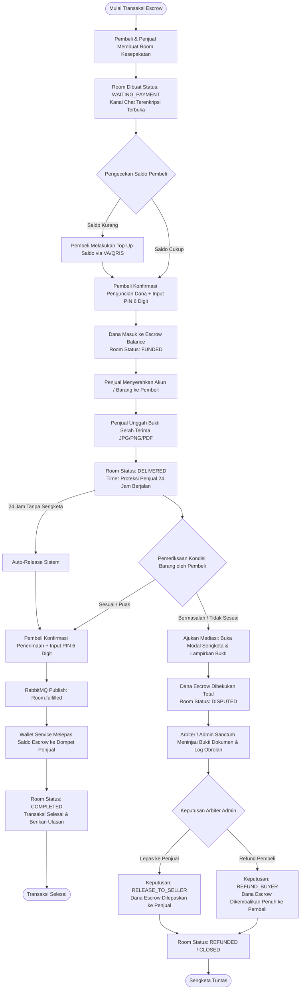
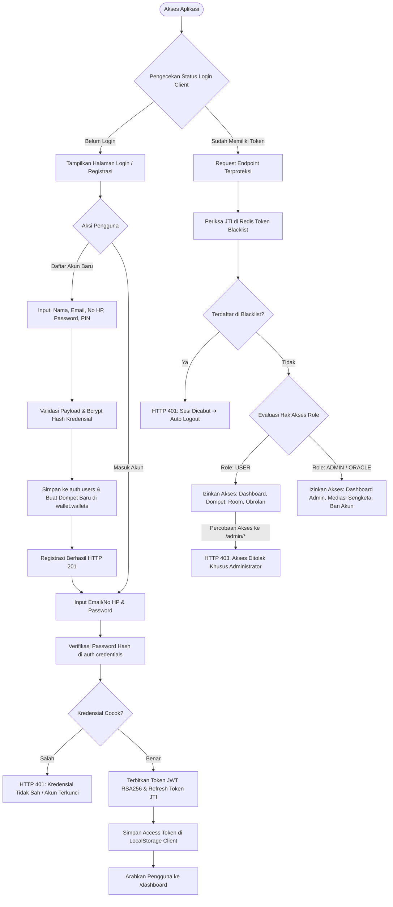
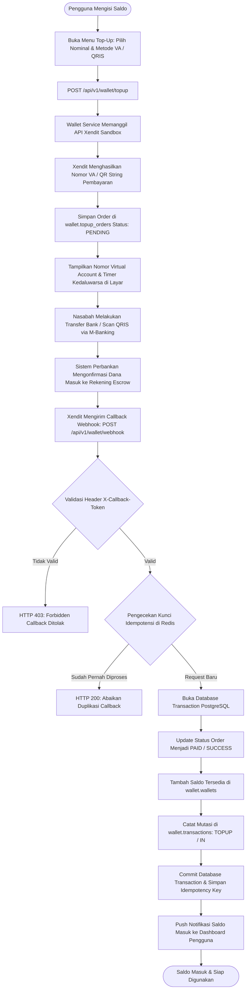

# EyesOfPriestess — System Flowchart & Architecture Diagrams

Dokumen ini berisi diagram alur (*flowcharts*) dan arsitektur sistem berbasis sintaks **Mermaid** untuk proyek Capstone S1 **EyesOfPriestess — The Covenant Protocol**. Seluruh diagram dirancang dengan hierarki bertingkat searah (*strict single-direction downward flow*) untuk memastikan **tidak ada garis panah yang saling tumpang tindih (*zero-crossing lines*)**.

---

## 1. Arsitektur Topologi Sistem (Tiered Architecture Flowchart)

Diagram bertingkat yang mengalirkan request secara bersih dari Client Layer, API Gateway, Microservices, Messaging/Integrasi, hingga Database Persistence Layer tanpa garis yang bersilangan.



---

## 2. Alur Transaksi Escrow Covenant (Escrow Room Lifecycle)

Flowchart siklus transaksi escrow mulai dari pembuatan room, penguncian saldo, pengiriman bukti serah terima, hingga penyelesaian transaksi atau sengketa mediasi.



---

## 3. Alur Autentikasi & Keamanan Akses (JWT & RBAC Guard)

Diagram proses autentikasi akun baru, login kredensial, penerbitan sepasang token JWT asimetris, dan validasi hak akses pengguna vs admin.



---

## 4. Alur Pembayaran & Webhook Payment Gateway (Xendit)

Diagram alur permintaan top-up, pembuatan invoice pembayaran, verifikasi token callback, dan jaminan idempotensi saldo.



---

## 5. Alur Mediasi & Putusan Sengketa (Dispute Resolution Flow)

Diagram alur terperinci penanganan perselisihan transaksi escrow di bawah wewenang *High Oracle Administrator*.

```mermaid
flowchart TD
    D_START([Pengguna Mengalami Masalah]) --> D_MODAL[Klik 'Laporkan Sengketa' di Halaman Room]
    D_MODAL --> D_INPUT[Pilih Kategori Masalah & Tuliskan Kronologi Rinci]
    D_INPUT --> D_UPLOAD[Lampirkan Bukti Tangkapan Layar / Dokumen PDF via FileUpload]
    D_UPLOAD --> D_SUBMIT[Kirim Sengketa: POST /api/v1/room/{id}/dispute]

    D_SUBMIT --> D_FREEZE[Dana Escrow Dibekukan Total & Room Berstatus: DISPUTED]
    D_FREEZE --> D_EVENT[Publish Event: Room.broken Melalui RabbitMQ]
    
    D_EVENT --> D_CASE[Dispute Service Membuka Kasus Baru di dispute.disputes]
    D_CASE --> D_QUEUE[Kasus Masuk ke Antrean Mediasi /admin#disputes]
    
    D_QUEUE --> D_ADMIN_VIEW[Arbiter Administrator Memeriksa Berkas Kasus]
    D_ADMIN_VIEW --> D_ANALYZE[Pemeriksaan: Bukti Serah Terima, Log Obrolan, dan Kredensial]
    
    D_ANALYZE --> D_DECISION{Pertimbangan & Putusan Arbiter}

    D_DECISION -- Pelanggaran oleh Penjual --> D_REFUND[Eksekusi Putusan: REFUND_BUYER]
    D_DECISION -- Kewajiban Penjual Terbukti Sah --> D_RELEASE[Eksekusi Putusan: RELEASE_TO_SELLER]

    D_REFUND --> D_PUB_RESOLVED[Publish Event: judgment.resolved ke RabbitMQ]
    D_RELEASE --> D_PUB_RESOLVED

    D_PUB_RESOLVED --> D_WALLET_SETTLE[Wallet Service Mengeksekusi Rekonsiliasi Saldo]
    D_WALLET_SETTLE --> D_TRANSFER_WINNER[Pencairan Saldo Otomatis ke Dompet Pihak yang Berhak]
    
    D_TRANSFER_WINNER --> D_CLOSE_CASE[Kasus Status: RESOLVED | Room Status: CLOSED]
    D_CLOSE_CASE --> D_NOTIF[Kirim Toast & Notifikasi Keputusan Resmi ke Kedua Pengguna]
    D_NOTIF --> D_END([Sengketa Ditutup Adil])
```
